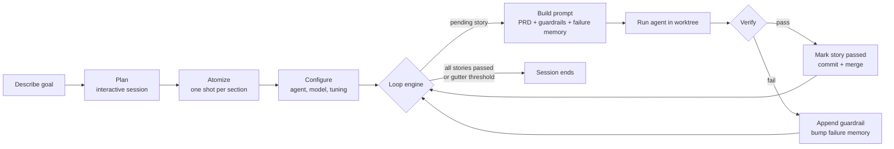
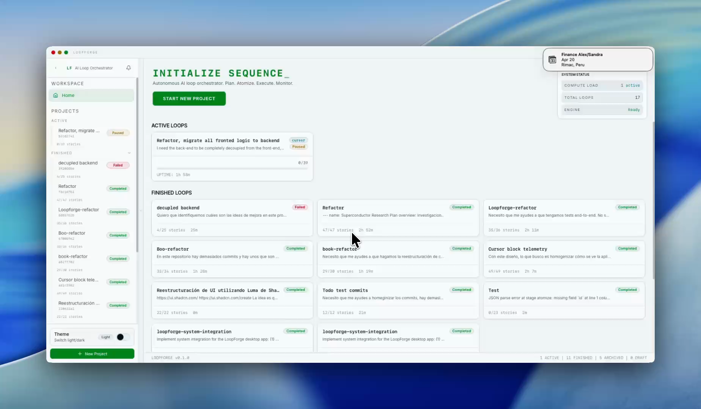

<div align="center">
  

  <h1>LoopForge</h1>

  <p><strong>A desktop orchestrator that turns any AI coding CLI into a long running, self verifying engineer.</strong></p>

  <p>Plan. Atomize. Execute. Monitor.</p>

  <p>
    <a href="https://github.com/taberoajorge/loopforge/releases"></a>
    <a href="https://github.com/taberoajorge/loopforge/actions/workflows/test.yml"></a>
    <a href="LICENSE"></a>
    
    
    
    
  </p>
</div>

> [!NOTE]
> LoopForge operationalises the Ralph loop pattern popularised by [Geoffrey Huntley](https://ghuntley.com/ralph) and gives it a visual control plane. Bring your own CLI agent, describe the work as atomic stories, then let the loop grind until every story passes verification.

<details>
<summary><strong>Table of contents</strong></summary>

1. [Why LoopForge](#why-loopforge)
2. [How the loop works](#how-the-loop-works)
3. [Features](#features)
4. [Demo](#demo)
5. [Quick start](#quick-start)
6. [Your first loop](#your-first-loop)
7. [Use cases](#use-cases)
8. [Supported providers](#supported-providers)
9. [Artifacts and file layout](#artifacts-and-file-layout)
10. [Configuration](#configuration)
11. [Build from source](#build-from-source)
12. [Architecture](#architecture)
13. [Roadmap](#roadmap)
14. [Troubleshooting](#troubleshooting)
15. [Contributing](#contributing)
16. [Security](#security)
17. [License and credits](#license-and-credits)

</details>

## Why LoopForge

Single shot prompts are fine for five minute changes. They fall over on the work that actually consumes engineering time: porting a legacy service from one language to another, regenerating a test suite, filling in months of missing documentation, or hardening a module until every boundary has coverage. Running a CLI agent once rarely finishes that work, and running it by hand in a terminal loop is tedious and opaque.

LoopForge takes Ralph, the bash loop that Huntley described as "deterministically bad in an undeterministic world", and turns it into a desktop product:

- A wizard captures the plan and atomises it into small, verifiable stories.
- A loop engine runs one story per iteration, reloads the PRD every time, and keeps the filesystem plus git as the source of truth.
- A monitor streams the live output of the chosen agent, together with iteration count, commits, failures and rate limit events.
- Parallel work is isolated in git worktrees so multiple stories can land without stepping on each other.

If Cursor and Claude Code are the cockpit for interactive coding, LoopForge is the autopilot for the long haul.

## How the loop works



At any iteration the loop honours three control files: `.ralph-pause` freezes work, `.ralph-done` ends the session cleanly, and `failure_memory.json` records how many times each story has failed so that a story hitting the gutter threshold is skipped and flagged for human review.

## Features

| Area | What you get |
|---|---|
| Wizard | Five step flow: Describe, Plan, Atomize, Configure, Launch. Each step persists to disk so a draft can be resumed after a reboot. |
| Plan engine | Drives an interactive planning session with any supported agent and streams the agent output into `plan.md`. |
| Atomizer | MiniJinja pipeline that chunks `plan.md`, asks the agent to emit strict JSON user stories, merges batches and writes `prd.json`. |
| Loop engine | Runs the Ralph loop with configurable iteration cap, cooldown, stall timeout, verification retries and gutter threshold. |
| Parallel stories | Ready stories that have no unresolved dependencies can run concurrently in isolated git worktrees. Successful branches are fast forward merged and torn down automatically. |
| Failure memory | Keeps a rolling record of story failures; the next prompt carries the previous failure signal so the agent stops repeating the same mistake. |
| Rate limit detection | Scans agent output for common throttle signatures (Claude, OpenAI, OpenRouter, Gemini) and pauses before retrying. |
| Guardrails | `guardrails.md` accumulates durable "do not do this again" notes across iterations of a project. |
| Monitor | Live terminal with xterm.js, progress tab with story state, activity log, raw output log and an Ask tab for quick side questions. |
| Desktop integration | Tray icon, system notifications, dark mode, transparent window effects, auto updater wired to GitHub Releases. |
| Bring your own agent | Works with any CLI binary that exits non zero on failure. No vendor lock in, no managed credentials. |

## Demo

> [!TIP]
> Watch the short product walkthrough on Screen Studio.
>
> [](https://screen.studio/share/1LFJxw9J)
>
> Installers and release notes are on the [Releases page](https://github.com/taberoajorge/loopforge/releases). For a text walkthrough of a real session, see [Your first loop](#your-first-loop).

## Quick start

### 1. Install an agent CLI

LoopForge does not ship with a language model. Install at least one of the following and make sure it is on your `PATH`:

| Agent | Install command | Docs |
|---|---|---|
| Claude Code | `npm i -g @anthropic-ai/claude-code` | [claude.com](https://www.claude.com/product/claude-code) |
| OpenAI Codex | `npm i -g @openai/codex` | [openai.com/codex](https://developers.openai.com/codex) |
| Cursor Agent | Installed with the [Cursor app](https://cursor.com/) | [docs.cursor.com](https://docs.cursor.com/) |
| Gemini CLI | `npm i -g @google/gemini-cli` | [geminicli.com](https://geminicli.com/) |
| OpenCode | `curl -fsSL https://opencode.ai/install \| bash` | [opencode.ai](https://opencode.ai/) |

LoopForge detects installed agents at launch and shows them in the system readiness panel.

### 2. Install LoopForge

<details open>
<summary><strong>Download a release (recommended)</strong></summary>

Grab the latest installer for your platform from the [Releases page](https://github.com/taberoajorge/loopforge/releases).

| Platform | Asset |
|---|---|
| macOS (Apple Silicon) | `LoopForge_<version>_aarch64.dmg` |
| macOS (Intel) | `LoopForge_<version>_x64.dmg` |
| Linux (Debian, Ubuntu) | `loopforge_<version>_amd64.deb` |
| Linux (AppImage) | `loopforge_<version>_amd64.AppImage` |
| Windows | `LoopForge_<version>_x64-setup.exe` |

Open the installer and follow the prompts. Auto updates land through GitHub Releases.

</details>

<details>
<summary><strong>Run from source</strong></summary>

Prerequisites:

- Rust 1.77 or newer (`rustup default stable`)
- Bun 1.3 or newer (`curl -fsSL https://bun.sh/install | bash`)
- Platform toolchain for Tauri (see the [Tauri prerequisites guide](https://tauri.app/start/prerequisites/))

Clone and launch:

```bash
git clone https://github.com/taberoajorge/loopforge.git
cd loopforge
bun install
bun run tauri dev
```

The app opens at the splash window after the first compile. Subsequent launches are seconds.

</details>

### 3. Verify the install

Open LoopForge. The launch screen shows a System Readiness panel. Confirm:

- Git is available.
- At least one agent is listed as available.
- The shell is detected.

Dismiss the panel or refresh after installing a missing agent.

## Your first loop

1. **Describe**. Name the project, pick the working directory and write a short description of the outcome. LoopForge saves a draft immediately.
2. **Plan**. Choose an agent and start the planning session. The agent interviews you through the terminal pane and writes the conversation to `plan.md` until you accept the plan.
3. **Atomize**. LoopForge splits `plan.md` into sections, asks the agent to generate strict JSON stories per section, merges the batches and dedupes. Review the list, edit titles, acceptance criteria or dependencies, and confirm.
4. **Configure**. Pick the execution agent, model, effort level, iteration cap, cooldown, stall timeout, gutter threshold and optional test command.
5. **Launch**. LoopForge creates the canonical artifacts, starts the loop and switches to the Monitor.
6. **Monitor**. Watch stories change from pending to passed. Pause, resume or stop the loop. When every story passes, the session ends and the project moves to the Finished list.

> [!IMPORTANT]
> Every iteration starts from a fresh context window. If a story depends on work from a previous iteration, encode that dependency in `dependsOn` in `prd.json`. The loop never carries conversational state across iterations, only durable artifacts.

## Use cases

- **Legacy migrations**. Port a Java backend to TypeScript one module at a time, with every story gated by the new test suite. This is how LoopForge was stress tested during development.
- **Large refactors**. Replace a homegrown module with a library, split a service, or migrate a test runner (for example Jest to Vitest), iterating until the build and the tests go green.
- **Test coverage backfill**. Feed LoopForge a coverage report and let it write missing tests until the line coverage threshold is met.
- **Documentation sweeps**. Regenerate or modernise the docs folder, one file per story, with a verification that runs `bun run typecheck` on code samples.
- **Greenfield spikes**. Take a PRD for a new CLI, service or app and let LoopForge scaffold, wire and verify each vertical slice.
- **Scripted dependency upgrades**. Codify the upgrade recipe, let the loop run through every touched file, and merge when CI passes.

> [!WARNING]
> Ralph style loops are powerful precisely because they will keep going. Always run them inside a sandbox, a container or a disposable branch. Set an iteration cap, a gutter threshold and a test command before you hit Launch.

## Supported providers

LoopForge detects provider binaries at launch through the `detect_agents` command. The loop engine also ships an `OpenRouter` provider for routing through a single account.

| Provider | Binary detected | Supports plan | Supports execute | Notes |
|---|---|---|---|---|
| Claude Code | `claude` | yes | yes | Runs with `--dangerously-skip-permissions` for unattended sessions. |
| OpenAI Codex | `codex` | yes | yes | Honours Codex rate card limits. |
| Cursor Agent | `cursor-agent` | yes | yes | Requires a Cursor subscription. |
| Gemini CLI | `gemini` | yes | yes | Uses the authenticated Google account. |
| OpenCode | `opencode` | yes | yes | Best for cost sensitive long runs. |
| OpenRouter | via API | no | yes (programmatic) | Routes through any model OpenRouter exposes. |

Each provider uses the same `AgentResult` contract, so swapping one for another in `config.json` does not require code changes.

## Artifacts and file layout

Per project directory:

```
<project-root>/
  draft.json          wizard snapshot, written during every wizard transition
  plan.md             plan conversation persisted by the plan engine
  prd.json            canonical PRD emitted by the atomizer, edited in the UI
  config.json         execution configuration written by the Configure step
  prompt.md           execution prompt written by the atomizer stage 4
  guardrails.md       living document of constraints accumulated across iterations
  .ralph_state        runtime state, iteration counters and health metadata
  .ralph-pause        sentinel file, presence pauses the loop
  .ralph-done         sentinel file, presence ends the loop cleanly
  failure_memory.json rolling log of recent failures per story
  activity.log        human readable activity feed consumed by the Monitor
  error.log           error channel for the loop engine
  codex_output.log    raw agent output for the Raw Output tab
```

LoopForge also stores project metadata and session state in a local SQLite database under the platform data directory (for example `~/Library/Application Support/com.loopforge.desktop/loopforge.db` on macOS).

## Configuration

The loop engine reads tuning values from `config.json`, with environment variable overrides available for advanced users.

| Variable | Default | Purpose |
|---|---|---|
| `MAX_ITERATIONS` | `9999` | Hard cap on iterations before the session stops. |
| `RATE_LIMIT_WAIT` | `120` | Seconds to wait after a rate limit is detected. |
| `GUTTER_THRESHOLD` | `3` | Consecutive failures before a story is blocked. |
| `CODEX_STALL_TIMEOUT` | `300` | Seconds without output before the agent is treated as stalled. |
| `MAX_VERIFICATION_RETRIES` | `3` | Retries for the verification command after a story claims completion. |

A minimal `config.json`:

```json
{
  "project": { "working_directory": "." },
  "prd": {
    "path": "prd.json",
    "prompt": "prompt.md",
    "guardrails": "guardrails.md",
    "progress": "activity.log"
  },
  "test": { "command": "bun run typecheck" }
}
```

## Build from source

```bash
git clone https://github.com/taberoajorge/loopforge.git
cd loopforge
bun install
bun run tauri dev           # dev with hot reload
bun run tauri build         # release installer for the host platform
cargo test                  # Rust unit and integration tests
bun run test                # Vitest unit tests
bun run typecheck           # TypeScript type check
bun run e2e:smoke           # WebdriverIO smoke test
```

<details>
<summary><strong>Useful scripts</strong></summary>

| Command | Purpose |
|---|---|
| `bun run dev` | Vite dev server on port 1420, frontend only. |
| `bun run dev:tauri` | Vite dev server prepared for Tauri. |
| `bun run build` | Production build of the frontend. |
| `bun run lint` / `lint:fix` | Biome lint. |
| `bun run format` / `format:fix` | Biome formatter. |
| `bun run e2e` | Full WebdriverIO suite. |
| `cargo test --workspace` | Every Rust crate in the workspace. |

</details>

## Architecture

LoopForge uses a three layer hexagonal architecture with explicit boundaries.

| Layer | Directory | Responsibility |
|---|---|---|
| Domain | `crates/ralph-core/src/` | Pure loop logic, providers, PRD, prompt builder, detection, verification, configuration. |
| Shell | `src-tauri/src/` | Tauri commands, event streams, SQLite storage, process lifecycle and filesystem adapters. |
| UI | `src/` | React 19 pages, features, stores and components built on Tailwind and Radix. |

IPC uses `#[tauri::command]` for request and response, and `app.emit()` for streaming events such as agent output, iteration updates, story completions, story blocks and rate limit notices.

For deeper references see [AGENTS.md](AGENTS.md) and [CLAUDE.md](CLAUDE.md), which document module boundaries, the artifact contract and the conventions every contribution follows.

## Roadmap

- [x] Plan, Atomize, Execute, Monitor vertical slice
- [x] Parallel stories through git worktrees with automatic merge and teardown
- [x] Failure memory and gutter threshold
- [x] Rate limit detection across major providers
- [x] Signed release workflow for macOS, Linux, Windows
- [ ] Cost and token usage tracking in the Monitor
- [ ] Shareable PRD bundles that can be imported into a new project
- [ ] Native MCP server so other tools can read and write LoopForge projects
- [ ] Plugin API for custom verification hooks
- [ ] Remote execution mode targeting a headless daemon

## Troubleshooting

<details>
<summary><strong>The loop stops saying "services unavailable"</strong></summary>

The health checker could not reach an external service the project depends on. Update `config.json` with the right health URL or mark the service as `optional = true`.

</details>

<details>
<summary><strong>A story fails the same way three times and is blocked</strong></summary>

That is the gutter threshold doing its job. Open the story in the Atomize tab, tighten the acceptance criteria or split it into smaller stories, then relaunch. You can also raise `GUTTER_THRESHOLD` but only after understanding why the agent keeps failing.

</details>

<details>
<summary><strong>Parallel stories leave orphan branches</strong></summary>

A failed or rate limited worker will keep its worktree for manual inspection. Inspect `<project-root>/.loopforge/worktrees`, review the branch, then run `git worktree remove` if you do not need it.

</details>

<details>
<summary><strong>The agent hangs for a long time with no output</strong></summary>

LoopForge kills stalled processes after `CODEX_STALL_TIMEOUT` seconds by default. If your model legitimately takes longer, bump the value in the Configure step.

</details>

## Contributing

Pull requests are welcome. Start with [CONTRIBUTING.md](CONTRIBUTING.md). The short version:

- Follow the conventions in [AGENTS.md](AGENTS.md) and the scoped rules under `.cursor/rules/`.
- Keep every Rust and TypeScript file under 200 lines.
- No comments, no JSDoc, no single character variables, no `eslint-disable`.
- Commit format is `type(scope): description` and commits are atomic.
- Run `cargo test`, `bun run typecheck` and `bun run test` before opening a PR.

If you want to discuss a larger change first, open an issue labelled `proposal`.

## Security

LoopForge runs agent CLIs with your credentials on your machine. Treat the output as untrusted code until it is reviewed.

> [!CAUTION]
> Always run LoopForge against a disposable branch or a sandboxed checkout. The loop commits, merges and deletes worktrees by design.

To report a vulnerability, email the maintainer listed in [AGENTS.md](AGENTS.md) rather than opening a public issue.

## License and credits

LoopForge is released under the [MIT License](LICENSE).

- The Ralph loop pattern was described by [Geoffrey Huntley](https://ghuntley.com/ralph) in 2025 and popularised under the "Ralph Wiggum" nickname.
- The three layer architecture borrows from the Tauri community and the hexagonal pattern commonly used in Rust services.
- Monospace UI typography uses [Inter Variable](https://rsms.me/inter/) and the terminal is rendered by [xterm.js](https://xtermjs.org/).

Stand on the shoulders of the giants, then iterate.
